### Introduction

A breadboard is a circuit board that is used to make temporary circuits. This device has holes in it and strips of metal below the board which connect the holes placed on the top of the board. Breadboards are solderless and they are made of two kinds of strips i.e. terminal and bus strips. Terminal strips help in holding the electronic elements while the bus strips are used to power electric power to all the electronic components. In order to form a circuit, wires are inserted simply inside the holes. An advantage of using a breadboard is that the positions of the wires can be changed if they are placed in a wrong order. The connections of the breadboard are mostly temporary and the elements can further be reassembled and reused without any damage. No soldering is required so it is easy to change connections and replace components. Today, starting from tiny analog, digital circuits to big complicated CPUs, everything can be tested with the help of this.  
The name “breadboard” goes way back to the days when people literally used a piece of wood (shown in Fig.1) on which they sliced bread, in order to construct electronic circuits. They used nails and wires to connect up the components. Nowadays, the new generation of “breadboard” is made from a rectangular piece of plastic, but we still refer to them by the name “breadboard.”

 

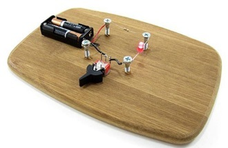  

**Fig. 1 Breadboard circuit in the past** 

Breadboards come in various brands and sizes to suit the requirements of the electronic circuits. Nevertheless, all breadboards share the same fundamentals and ideas.  
Here are some types of a standard breadboard :-

1.  Full-size
2.  Half-size
3.  Mini-size

Moreover, there are different colors of breadboards (white, blue, red, green, yellow, transparent). Fig. 2 shows different types of breadboards.

  
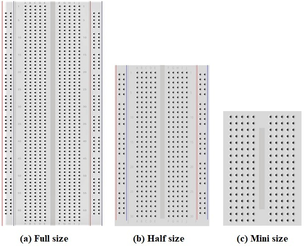  

**Fig. 2 Different types of breadboards** 

Breadboards have many tiny sockets (called 'holes') arranged on a 0.1" grid. Sockets are used to hold the components in a circuit. The leads of most components can be pushed straight into the holes. Total no. of holes in one unit of breadboard is 420. There are sixty-four groups of 5 horizontally connected terminals and four buses of 25 vertically connected terminals. The top and bottom rows of holes are connected horizontally while the remaining holes are connected vertically as shown in Fig. 3. A middle divider or “ravine” runs vertically and divides the breadboard symmetrically into left and right sides. The halves of the breadboard are electrically isolated from each other by the middle divider.

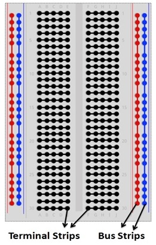  

**Fig. 3 Breadboard holes connections**

In order to identify vertical columns, letters from “A” to “J” are printed at the top and bottom of the breadboard running horizontally and dividing the holes evenly into vertical lines. To identify horizontal rows, numbers from 1 to 30 are printed on left and right edges on half-size breadboards and from 1 to 60 or 63 on full-size breadboards. Some breadboards use skip-counting in fives, but it doesn’t change the main concept of row-numbering on breadboards. Together, the numbers and letters guide us to locate a certain hole easily while building complicated circuits or during troubleshooting. For instance, hole “G15” is located at the intersection of column “G” and row “15.”

 

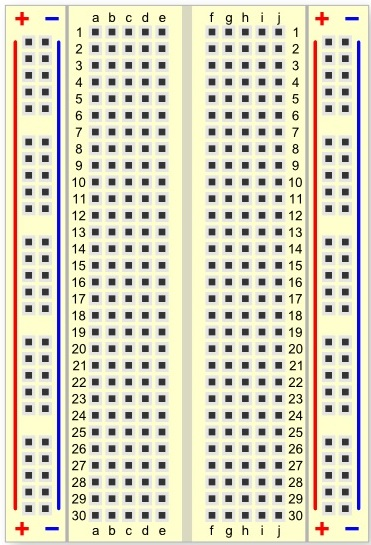

**Fig. 4 A breadboard have numbers and letters marked on various rows and columns** 

Here we have a breadboard where the adhesive backing has been removed (Fig. 5).

  
  

**Fig. 5 A Breadboard with the adhesive backing removed** 

We can see lots of horizontal rows of metal strips on the bottom of the breadboard. The rows or ‘Terminal strips’ are where we are supposed to connect the electronic components. The top of the metal rows has little clips that hide under the plastic holes. This is what the clip looks like when it is removed from a breadboard.

  
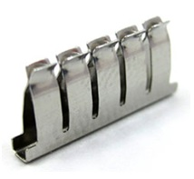  

**Fig. 6 A single strip of conductive metal** 

This means each set of five holes forming a half-row (columns A–E or columns F–J) is electrically connected. For example, that means hole A1 is electrically connected to holes B1, C1, D1 and E1. It is not connected to hole A2, because that hole is in a different row, with a separate set of metal clips. It is also not connected to holes F1, G1, H1, I1 or J1, because they are on the other "half" of the breadboard and the clips are not connected across the gap in the middle. When we press a component's lead into the exposed holes on a breadboard, one of these clips grabs onto it. Once inserted that component will be electrically connected to anything else placed in that row (Fig. 7). This is because the metal rows are conductive and allow current to flow from any point in that strip. Wire links can be made with single-core plastic-coated wire of 0.6 mm diameter (the standard size). Stranded wire is not suitable because it will crumple when pushed into a hole and it may damage the board if strands break off.

  
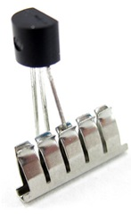  

**Fig. 7 An electric component inserted in single strip of conductive metal** 

Unlike all the main breadboard rows, which are connected in sets of five holes, the buses or power rails run the entire length of the breadboard. These power rails are metal strips that are identical to the ones that run horizontally, except they are, typically, all connected. When building a circuit, we tend to need power in lots of different places. The power rails give us lots of easy access to power wherever we need it in our circuit. Usually they are labeled with A+ and A− and have a red and blue or black strip, to indicate the positive and negative side.

It is important to be aware that the power rails on either side are not connected, so if we want the same power source on both sides, we need to connect the two sides with some jumper wires. We should keep in mind that the markings are there just as a reference. There is no rule that says we have to plug power into the '+' rail and ground into the '−' rail, though it's good practice to keep everything in order. Fig. 8 shows how two jumper wires used to connect the power rails on both sides. Always attach the '+' to '+' and the '−' to '−'.

 

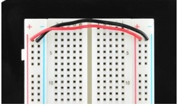  

**Fig. 8 Two jumper wires used to connect the power rails on both sides** 

Fig. 9 shows, an LED inserted into a breadboard. Here each leg of the LED is placed on either side of the ravine. This prevents the connections to the LED from being shorted.

  
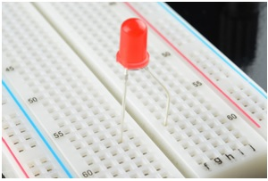  

**Fig. 9 A LED inserted into a breadboard** 

Integrated circuits(ICs) are inserted across the central gap with their notch or dot to the left.IC pins are numbered anti-clockwise around the IC starting near the notch or dot. Fig. 10 shows the numbering for 8-pin and 14-pin ICs, but the principle is the same for all sizes.

  
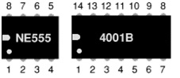  

**Fig. 10 Numbering for 8-pin and 14-pin ICs** 

Earlier we mentioned that the ravine isolates the two sides of a breadboard. This ravine serves a very important purpose. Many ICs are manufactured specifically to fit onto breadboards. In order to minimize the amount of space they take up on the breadboard, they come in what is known as a Dual in-line Package or DIP. These DIP chips have legs that come out of both sides and fit perfectly over that ravine. Since each leg on the IC is unique, we don’t want both sides to be connected to each other. That is where the separation in the middle of the board comes in handy. Thus, we can connect components to each side of the IC without interfering with the functionality of the leg on the opposite side.

  
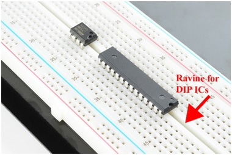  

**Fig. 11 Two DIP ICs inserted in breadboard**  

Suppose we want to construct the following series-parallel combination circuit on a breadboard.

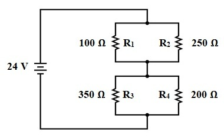  

**Fig. 12 A series-parallel combination circuit** 

The recommended way to do so on a breadboard would be to arrange the resistors in approximately the same pattern as seen in the schematic. If 24 volts is required and we only have 6-volt batteries available, four may be connected in series to achieve the same effect:

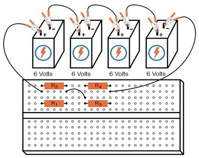  

This is by no means the only way to connect these four resistors together to form the circuit shown in the schematic. An alternative layout may be:

  
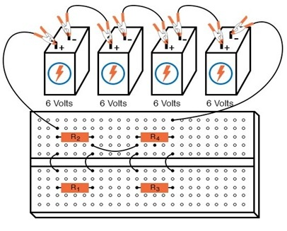   

**Fig. 13: Series - Parallel Circuit construction on a Terminal Strip** 

Breadboards have their limitations, though. First and foremost, they are intended for temporary construction only. If you pick up a breadboard, turn it upside-down and shake it, any components plugged into it are sure to loosen and may fall out of their respective holes. Also, breadboards are limited to fairly low-current (less than 1 amp) circuits. Those spring clips have a small contact area and thus cannot support high currents without excessive heating.

