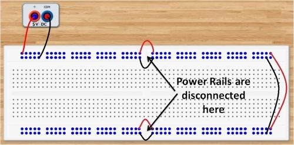
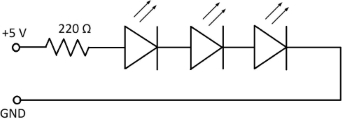
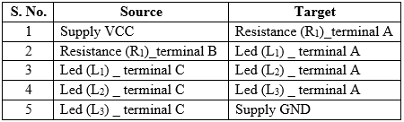
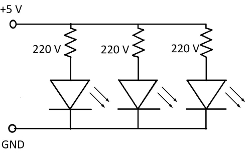
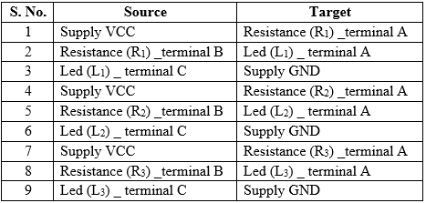
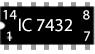
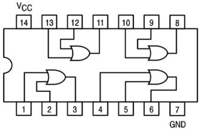
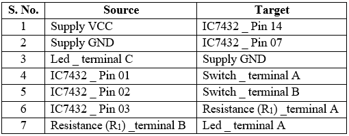

## Procedure 

1.  Click on **“Click Here”** in **Simulation** tab.
2.  Read every slide carefully to know about Breadboard connections.
3.  For next slide click on **\>** button and for previous slide click on **<** button.

  
#### **Power supply connections**

1.  Connect +5 V and ground terminals of the power supply to different power rails of one side of breadboard.
2.  Connect the power rails on both sides by using jumper wires.
3.  Connect horizontal rows by using jumper wires. 
 

      
    
  

**Fig. 1 A breadboard with power rail connections**  

  
4.  Thus, top and bottom rail sets of power rails become active which is shown by blue colour. Now, all holes of two sets of power rails are ready to use.
5.  As different components are placed over breadboard, all the holes which are internally connected become active and are shown in red colour.

#### **Familiarise with components** 

 

&emsp; &emsp; ")&emsp; ")&emsp; ")&emsp; ")&emsp; ")&emsp; ")
 

**Fig. 2 Components**  
 

#### **Series connections on Breadboard**

1.  Click on the **Component** button to place components on the table.
2.  Make connections as per the circuit diagram or connection table.
3.  All five holes in a vertical column are electrically connected; hence two legs of LED and resistance should be in different vertical columns. 

 

 

**Fig. 3 Circuit diagram for series connections of LEDs.** 

**Table 1: Connection table for series connection**

4.  Click on **Check Connections** button. If connections are right, click on **‘OK’**, then **Simulation** will become active.
5.  Observe output i.e. all LEDs will be ON.
6.  Now select Parallel connection.

#### **Parallel connections on Breadboard**

1.  Click on the **Component** button to place components on the table.
2.  Make connections as per the circuit diagram or connection table.

  

**Fig. 4 Circuit diagram for parallel connections of LEDs.**

**Table 2: Connection table for parallel connection**

 

  
3.  Click on **Check Connections** button. If connections are right, click on **‘OK’**, then **Simulation** will become active.
4.  Observe output i.e. all LEDs will be ON.
5.  Click on **\>** button for next slide.

#### **Familiarisation with Logic Gate connections of an IC 7432**

1.  Click on the **Component** button to place components on the table.

 

&emsp; &emsp; &emsp; ")&emsp; &emsp; ")&emsp; ")  

**Fig. 6 Components** 
 
  
2.  Note that IC’s half circle is on the left side on the breadboard.
3.  Connect **pin 14** to the **power supply (+5 V)** and **pin 7** to **ground (0 V)**. (Refer pin diagram of IC 7432). 

 

**Fig. 5 Pin Diagram of IC 7432**

**Table 3: Connection table**

  

  
4.  Connect **pin 1** and **pin 2** to toggle switches **A** and **B** respectively.
5.  Connect corresponding **output terminal (pin 3)** to **resistance (220 Ω)**. The other end of resistance is connected to positive (+) terminal of LED.
6.  Connect negative (–) terminal of the LED to ground.
7.  Click on **Check Connections** button. If connections are right, click on **‘OK’**, then **Simulation** will become active.
8.  Apply different combinations (0,0), (0,1), (1,0) and (1,1) to input terminals of one gate (say pins 1 and 2) by using toggle switches **A** and **B**.
9.  Observe the corresponding output on the **LED**.
10.  Fill the observed values in the **Truth Table**.
11.  Verify the **Truth Table** of 'OR' gate from the experimental results by clicking on **Check** button, if outputs are correct then click on **OK**.
12.  Repeat steps 4 to 11 for different gates of the IC.
13.  Click on the Reset button to reset the page.

